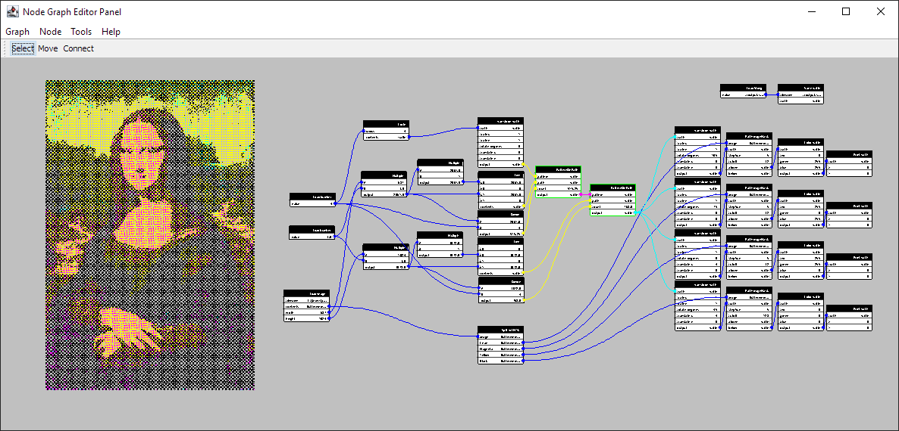

# Donatello: Flow-based Programming IDE

## What is it?

Donatello is a Java-based Integrated Development Environment (IDE) designed for 
[Flow-Based Programming (FBP)](https://en.wikipedia.org/wiki/Flow-based_programming).
It offers a graphical interface that simplifies the creation and management of complex
data flows, making it accessible for both novice and experienced developers.

## Features

- No-code style programming with a graphical interface.
- Syntax errors are impossible to make.  The editor will not let you connect nodes in a way that doesn't make sense.
- Nodes can run in parallel using virtual threads (JEP 425).

## Screenshots

## Getting started (Developers)

1. Clone [Donatello](https://github.com/MarginallyClever/Donatello/).
2. Use your favorite IDE to import the Maven project.
3. Donatello can be built to run on its own, or as a plugin in your project.

`./src/test/java/com/marginallyclever/donatello` has unit tests, which are also examples of how to use the API.

## Use it, Discuss it, Love it.

- Please see the [Javadoc with the full node graph API](https://marginallyclever.github.io/Donatello/javadoc).
- Please see guide for [how to Contribute](https://github.com/MarginallyClever/Donatello/blob/main/CONTRIBUTING.md)
- The [Official webpage](https://github.com/MarginallyClever/Donatello/)!
- Join [the Discord channel](https://discord.gg/Q5TZFmB) and make new friends.

## Based on work by

- https://github.com/otto-link/GNode/
- https://github.com/jpaulm/javafbp/
- https://nodes.io/story/
- https://github.com/janbijster/cobble
- https://github.com/kenk42292/shoyu
- https://github.com/paceholder/nodeeditor
- https://github.com/miho/VWorkflows
- https://nodered.org/
- Maya, Unity, Blender
- NoFlo, Flowhub
- and others

## Learn more

- [Flow based programming Discord](https://discord.com/invite/YBQj6UsD5H)
- https://jpaulm.github.io/fbp/

## Icons

Many app icons provided by http://icons8.com.
